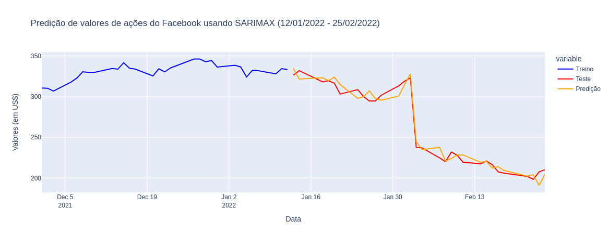
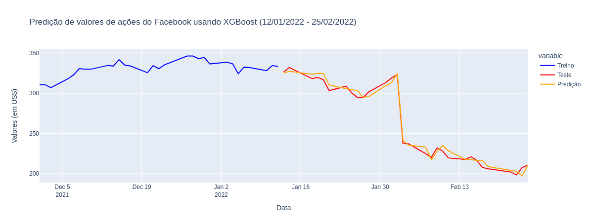
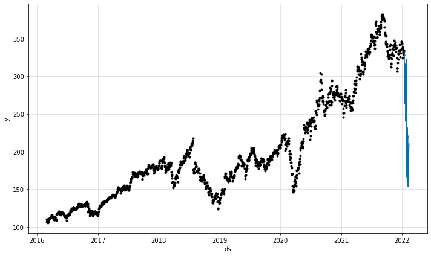
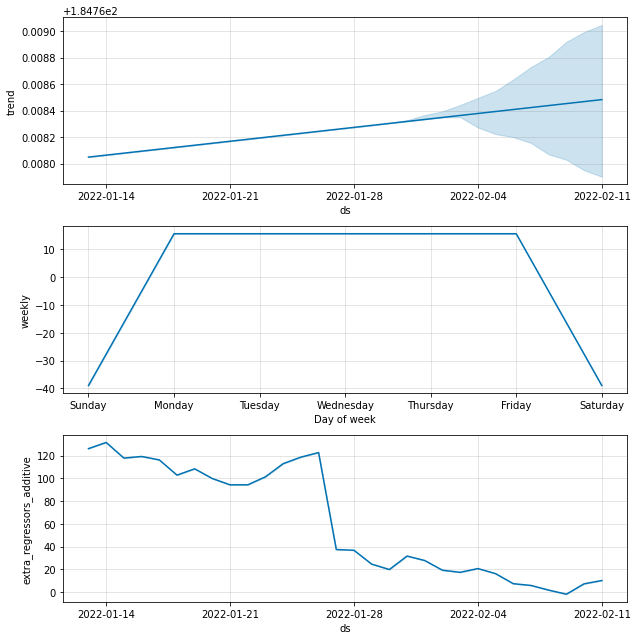

# Séries Temporais & Forecast usando SARIMAX, XGBoost e Facebook Prophet

## Objetivo  
Fazer predição de valores de ações do Facebook em um intervalo de 30 dias (entre 13/01/2022 e 25/02/2022), com dados de cinco anos (entre 29/02/2016 e 25/02/2022).

## Recursos utilizados
- Visual Studio Code
- python3.9
- virtualenv
- pip3: gerenciador de pacotes python3.x

## Pacotes do Python
- pandas
- plotly
- numpy
- pmdarima
- scikit-learn
- xgboost
- Facebook Prophet

## Conteúdos deste repositório
Este repositório contém três Jupyter Notebooks:
- SARIMAX.ipynb: notebook onde é usado o modelo estatístico SARIMAX para fazer forecast (previsão)
- XGBoost.ipynb: notebook onde é usado o modelo de regressão do XGBoost para fazer forecast (previsão)
- Prophet.ipynb: notebook onde é usado o Facebook Prophet para fazer forecast (previsão)

## Imagens dos modelos construídos

